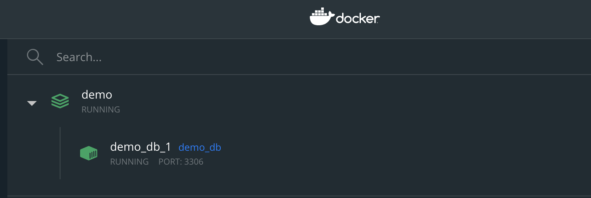

# Demo Project Interview

## Getting Started

### Dependencies

* Docker
* Java 1.8
* Spring-boot
* Maven

### Installing

1. Clone this repository
2. Open terminal and go to project path and type for run Sql server and initial Database
```
$ docker-compose up -d 
```
3. wait 90 second for initial Database after that make sure The database is ready to use
<p align="left">
  
</p>

 Connect to database
```
server   : localhost
port     : 3306
username : sa
password : password1234!
schemas  : demo-db
```

### Executing program

1. after 90 second build project
```
mvn clean install
```

2. Start the Demo project
```
mvn spring-boot:run
```

## Api

#### Registration api

```
curl --location --request POST 'http://localhost:8096/Demo-Project/member/saveMember' \
--header 'Content-Type: application/json' \
--data-raw '{
    "username":"testmember119",
    "password":"passw0rd",
    "address":"somewhere",
    "phone":"0825784983",
    "salary":"79000"
}'
```

#### Get all member api
```
curl --location --request GET 'http://localhost:8096/Demo-Project/member/'
```

#### Get all member api
```
curl --location --request GET 'http://localhost:8096/Demo-Project/member/get?username=jadymans'
```
